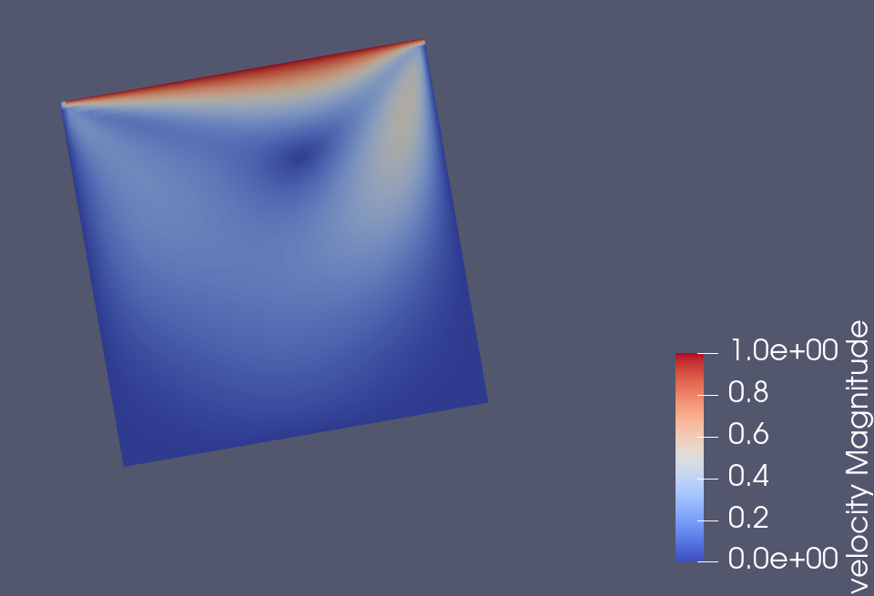
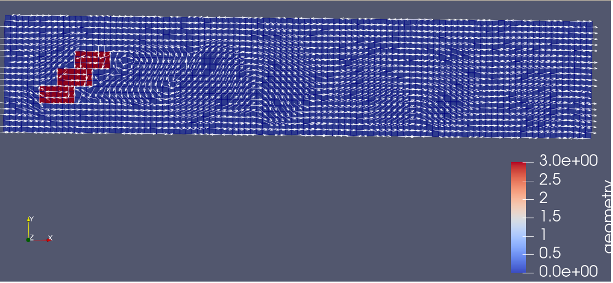
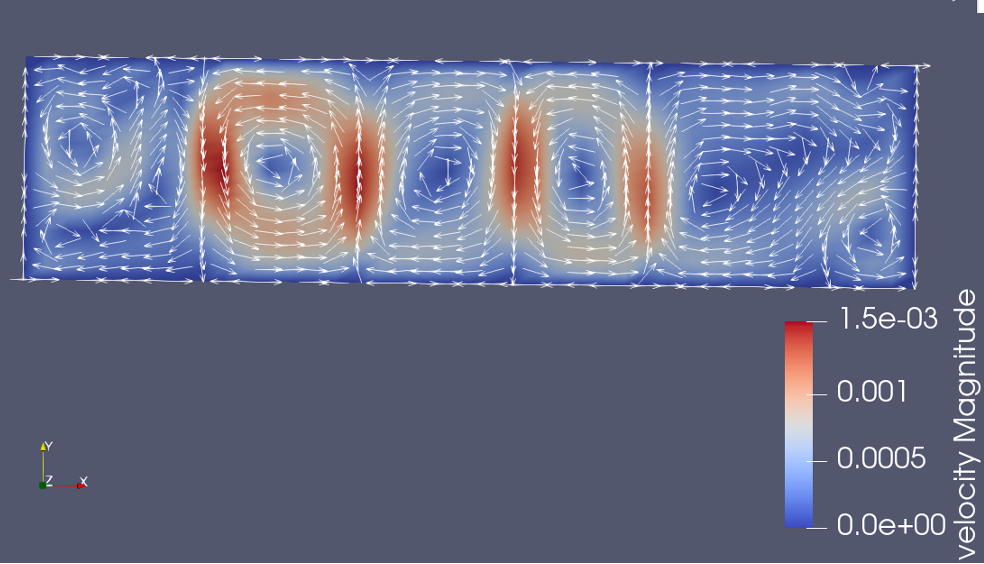

This repository is a CFD Solver developed by Qianqian, Christina and Wing To from TUM CSE. It is built on top of Fluidchen from TUM Informatics, Chair of Scientific Computing in Computer Science
## Feature
1. Support the simulation of fluid flow and generation of files(.vtk) that can be visualized in paraview  
2. Support artbitrary Geometry
3. Support energy with Boussinesq Approximation
4. Support MPI Parallelism

## Software Requirements
* VTK 7 or higher
* GCC 9 (optional)

### Setup of VTK and GCC 9 (Ubuntu **20.04**)

```shell
apt-get update &&
apt-get upgrade -y &&
apt-get install -y build-essential cmake libvtk7-dev libfmt-dev
```

## Installing

```shell
git clone https://gitlab.lrz.de/cfdlab_2021/fluidchen-skeleton.git GroupC_CFDLab
cd GroupC_CFDLab
mkdir build && cd build
cmake ..
make
```

If you are running GCC 8 or lower, you have to set gpp9 to false in CMakeList.txt. If you have many gcc installed into your system. It is better to use -DCMAKE_C_COMPILER option to specify the gcc you want to use. For example, to use gcc8, replace the cmake .. line above to :
```shell
cmake -DCMAKE_C_COMPILER=/usr/bin/gcc-8 -DCMAKE_CXX_COMPILER=/usr/bin/g++-8  ..
```

If you want to debug using gdb, do not forget to add debug option.
```shell
cmake -DCMAKE_BUILD_TYPE=Debug ..
```

## Running Example

In order to run the code, the case file should be given as input parameter. The lid driven cavity case files are located in the `example_cases` directory. In the build directory, 

```shell
./fluidchen /full_path_to_this_repo_in_your_system/example_cases/LidDrivenCavity/LidDrivenCavity.dat
```

This will run the case file and create the output folder `/full_path_to_this_repo_in_your_system/example_cases/LidDrivenCavity/LidDrivenCavityOutput` which holds the `.vtk` files of the solution.  Note that this may require write permissions in the given directory.

## Config

There are additional default config files located in the `configs` directory. Currently, cases like Karman Vortex Street, Flow Over Step, Fluid Trap and Rayleigh Benard convection are included. If you want to setup your own cases, please change the .dat file and the .pgm file accordingly. .dat file contains the parameters for the flow while .pgm file contains the geometry. Please note that the number of cells in the .dat file is needed to be aligned to that to the .pgm file in the way that the numbers in the .dat file should be smaller than that of .pgm by 2 in order to allow the creation of a layer of ghost boundary cells around the domain in the pgm file. \

In addition, note the number convention in the pgm files:\
- 0:  Fluid
- 1:  Inflow
- 2:  Outflow
- 3-7:  Wall/Obstacle

Furthermore, if you have to consider heat efect, in .dat file you have to set energy_eq to on while specify the wall temperature at the end of the .dat file. You can find Rayleigh Benard convection case as an example.

Note that in the Lid Driven Cavity Example you do not need to specify or write anything as it is hard coded in the program as an example.

## MPI Parallelism

You can use multi cores by using mpi Parallelism. We have made some configs that allow the use of that. For example `FluidTrapParallel`. 
You can run it by:

```shell
mpirun -np 6 --oversubscribe ./fluidchen (Path to your directory)/configs/FluidTrapParallel/FluidTrap.dat
```
If you want to change the number of cores to run, change the number after -np and the corresponding parameters iproc and jproc in the config file accordingly.

## Result Visualization

You can use paraview to visualize the output .vtk file. Here is an example showing the velocity magnitude of the LidDrivenCavity problem.

Lid Driven Cavity Example\


Support Arbitrary Geometry: Karman Vortex\


Support Energy : Rayleigh Benard\

